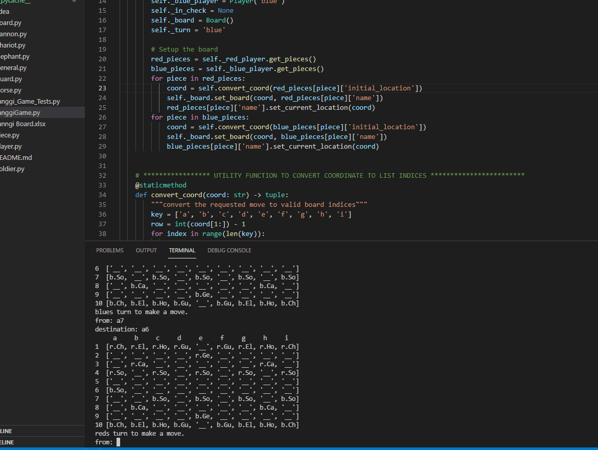

# Janggi - Korean Strategic Board Game

Janggi is strategy board game popular in Korea. It is similar to chess in that goal is to put the opposing player's general in checkmate. Each player starts with 16 pieces placed in a specific starting location on a 9x10 board. The pieces are placed on the intersections rather than inside the squares as it is played in chess. 

## How to Run
The program can be run from the JanggiGame.py file. The game is contained in the JanggiGame class. All necessary components of the game (board, players, pieces) are instantiated 
in the instance of the JanggiGame class. All components are contained in their respective .py files, and are imported as needed. The repository contains the tests for the program in Janggi_Game_Tests.py. 
The game is played from the command line. 

## Starting Pieces
 - General x 1
 - Elephant x 2
 - Chariot x 2
 - Horse x 2
 - Guard x 2
 - Soldier x 5
 - Cannon x 2

## Piece Movements
Note: We will quantify a unit a movement to be from one intersection to the next in any direction.

 - General
   - The general moves are restricted to be only within the palace. The palace is a 3x3 area on the board. There are two palaces, each on opposite sides of the board for each player.
   - The general may only move 1 unit vertically, horizontally, diagonally
   
- Elephant 
   - The elephant moves 1 unit orthogonally, and 2 units diagonally. The intermediate movements cannot be blocked by friendly or opposing piece. 
   
- Chariot
   - The chariot moves vertically or horizontally any amount of units on the board, as long as the path to the destination is not blocked by any piece.
   
- Horse 
   - The horse moves similar to that of the elephant. It moves 1 unit orthogonally and 1 unit diagonally. The intermediate movements cannot be blocked. 
   
- Guard 
   - The guard moves similar to that of the General. It moves 1 unit in any direction and is restricted in palace only.
   
- Soldier
   - The soldier only moves 1 unit forward or sideways. The soldier may not move backwards.
   
- Cannon
   - The cannon moves similar to that of the Chariot with the exception that there must be exactly one piece for the Cannon to 'jump' over to its destination.
   
## Sources
[wiki](https://en.wikipedia.org/wiki/Janggi)
